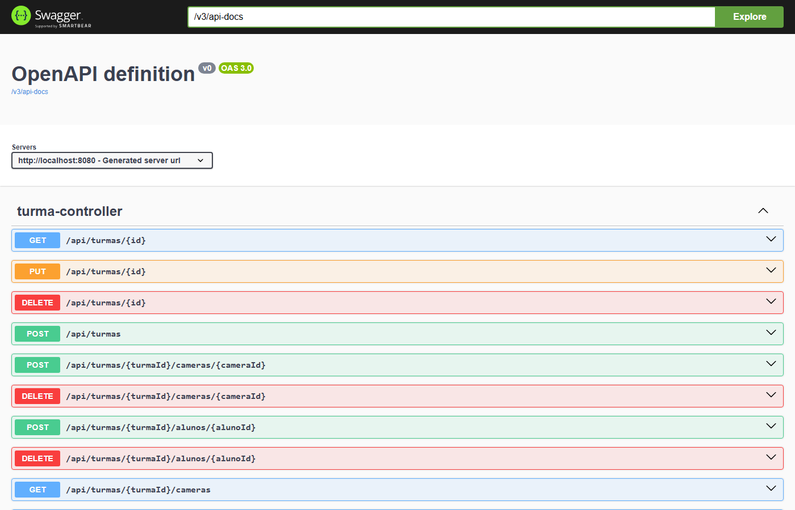
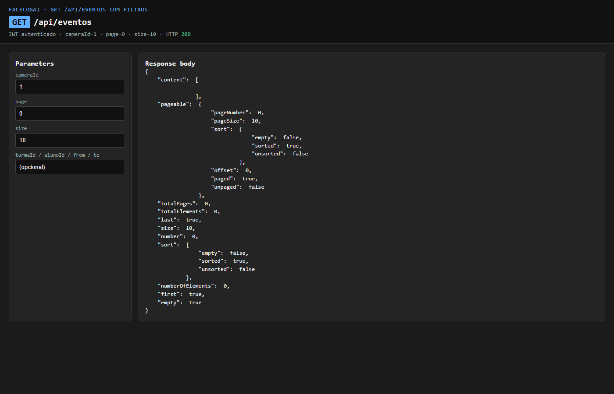
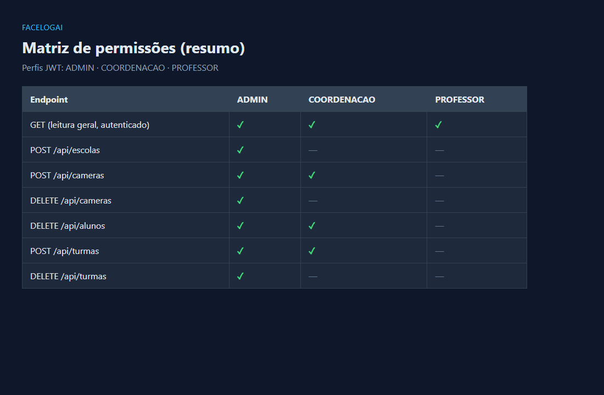

# FaceLogAI — Sistema de apoio a contexto escolar

API backend para **gestão de contexto escolar** (escolas, turmas, alunos, câmeras e **log de eventos**), com autenticação JWT e acesso por perfil. O MVP **não** faz stream de câmera, biometria nem reconhecimento facial: valores como `ROSTO_RECONHECIDO` no enum `TipoEvento` são só tipos de registro no log, prontos para uma evolução futura.

**Repositório público:** https://github.com/HelderAbud/Camera-Escolar

[](https://github.com/HelderAbud/Camera-Escolar/actions/workflows/ci.yml)

---

## Resumo para LinkedIn / vitrine (copiar)

**GitHub:** https://github.com/HelderAbud/Camera-Escolar

**Sistema de contexto escolar (FaceLogAI)**

API para organizar escolas, turmas, alunos, câmeras e eventos de monitoramento **como registros**, com JWT e perfis. Sem visão computacional no código atual.

**Tecnologias:** Java 21, Spring Boot 3, Spring Web, Spring Security, Spring Data JPA, Flyway (migrações de banco), JWT (autenticação), Springdoc OpenAPI (Swagger UI)  

**Destaques (MVP B0–B2 + P1):**

- API REST com JWT e perfis ADMIN / COORDENAÇÃO / PROFESSOR (RBAC em `@PreAuthorize`)
- CRUD de escolas, turmas, alunos e câmeras + eventos de monitoramento com filtros paginados
- Flyway + MySQL, Problem Details (RFC 7807), logs JSON, CI GitHub Actions; licença MIT
- Diagrama de domínio: [docs/portfolio/dominio.md](docs/portfolio/dominio.md)

---

## Visão rápida (portfólio / recrutador)

| Item | Valor |
|------|--------|
| **Problema que resolve** | Centralizar dados escolares (escolas, turmas, alunos, câmeras) com acesso por perfil. |
| **Demo / deploy** | Demo: em breve — ver Dia 8 da [`TRILHA-DIA-A-DIA.md`](TRILHA-DIA-A-DIA.md). Local: [Swagger UI](http://localhost:8082/swagger-ui.html) |
| **Repositório** | `https://github.com/HelderAbud/Camera-Escolar` |

---

## Stack principal

| Camada | Tecnologia |
|--------|------------|
| Linguagem | Java 21 |
| Framework | Spring Boot 3 |
| API | Spring Web (REST), Springdoc OpenAPI (Swagger UI) |
| Segurança | Spring Security, JWT |
| Persistência | Spring Data JPA, Flyway |
| Build | Maven |

**Bibliotecas ou integrações adicionais:** ver `pom.xml` (ex.: actuator, logstash encoder); complete aqui se adicionares integrações novas.

---

## Arquitetura

Padrão em camadas: **Controller → Service → Repository**, entidades JPA em `domain/`, contratos em `dto/`, erros em `api/`, configuração em `config/`.

```text
src/main/java/com/faceblogai/
├── controller/
├── service/
├── domain/
├── dto/
├── repository/
├── api/
└── config/
```

---

## Funcionalidades (estado atual)

- Autenticação JWT e perfis (ADMIN, COORDENACAO, PROFESSOR) com matriz de permissões abaixo.
- Endpoints de domínio escolar: escolas, câmeras, turmas, alunos, vínculos e eventos (log).
- Documentação interativa: Swagger UI.

### Matriz de permissões (contrato)

Perfis no JWT: `ADMIN`, `COORDENACAO`, `PROFESSOR` (enum `PerfilUsuario`).

Leitura (`GET`) exige JWT; os três perfis podem ler. Writes usam `@PreAuthorize`.

| Endpoint | ADMIN | COORDENACAO | PROFESSOR |
|----------|-------|-------------|-----------|
| GET (leitura autenticada) | ✓ | ✓ | ✓ |
| POST /api/escolas | ✓ | — | — |
| PUT /api/escolas/{id} | ✓ | ✓ | — |
| DELETE /api/escolas/{id} | ✓ | — | — |
| POST / PUT /api/cameras | ✓ | ✓ | — |
| DELETE /api/cameras/{id} | ✓ | — | — |
| POST / PUT /api/alunos | ✓ | ✓ | — |
| DELETE /api/alunos/{id} | ✓ | ✓ | — |
| POST / PUT /api/turmas | ✓ | ✓ | — |
| DELETE /api/turmas/{id} | ✓ | — | — |
| POST / DELETE vínculos (`/api/turmas/{id}/alunos`, `/cameras`) | ✓ | ✓ | — |
| POST /api/eventos | ✓ | ✓ | — |

PROFESSOR não altera cadastro nem registra eventos; só consulta.

---

## Como rodar (local)

### Pré-requisitos

- Java 21
- Maven 3.9+
- Docker (para o banco)

### Passos

```bash
cp .env.example .env
# Edite o .env com senhas locais antes de subir o banco.
```

```bash
docker compose up -d
```

```bash
# Gerar secret seguro:
openssl rand -base64 32
export JWT_SECRET_BASE64=[VALOR_GERADO]

# Opcional para ambiente local/dev: criar admin inicial em runtime
export FACELOGAI_SEED_ADMIN_ENABLED=true
export FACELOGAI_SEED_ADMIN_EMAIL=admin@facelogai.local
export FACELOGAI_SEED_ADMIN_PASSWORD=[SENHA_LOCAL_FORTE]
export DB_PASSWORD=[SENHA_MYSQL_LOCAL]
```

```bash
mvn spring-boot:run
```

Testes (H2 em memória; inclui os antigos `*IT`, agora `*Test`):

```bash
mvn clean test
```

- **API:** http://localhost:8082
- **Swagger UI:** http://localhost:8082/swagger-ui.html
- **Health:** http://localhost:8082/health
- **MySQL (host):** `3307` (matriz portfólio; ver `../Agentes/PORTFOLIO-PORTS.md`)

### Login de desenvolvimento

`POST /api/auth/login`

```json
{ "email": "admin@facelogai.local", "password": "[SENHA_LOCAL_FORTE]" }
```

O seed admin fica desabilitado por padrão. Habilite apenas em ambiente local/dev com `FACELOGAI_SEED_ADMIN_ENABLED=true` e defina a senha por variável de ambiente. Não use senha padrão em deploy.

---

## Documentação adicional

- [docs/deploy.md](docs/deploy.md) — plano de deploy (Railway + MySQL; seed OFF; rollback)
- [docs/BACKLOG.md](docs/BACKLOG.md) — marcos **B0–B2 concluídos** ✅
- [docs/portfolio/etapas.md](docs/portfolio/etapas.md) — narrativa de etapas (portfólio / entrevista)
- [docs/portfolio/dominio.md](docs/portfolio/dominio.md) — diagrama Mermaid do domínio
- [docs/WORKFLOW.md](docs/WORKFLOW.md)
- [TRILHA-DIA-A-DIA.md](TRILHA-DIA-A-DIA.md) — trilha portfólio (Helder + skills-pessoal)
- [LICENSE](LICENSE) — MIT

---

## Screenshots

| Tela | Ficheiro |
|------|----------|
| Swagger UI |  |
| GET `/api/eventos` com filtros |  |
| Matriz de permissões |  |

---

## Roadmap (ideias alinhadas ao mercado)

- [ ] Notificações de eventos
- [ ] Registo de presença integrado ao fluxo escolar
- [ ] Integração com IA / visão computacional (**não implementado**; enum `TipoEvento` só reserva nomes de log)
- [ ] Deploy (ex.: Render, Fly.io) — adicionar URL aqui e no topo quando existir

---

## Licença

Distribuído sob a licença [MIT](LICENSE). Copyright (c) 2026 Helder Abud.
