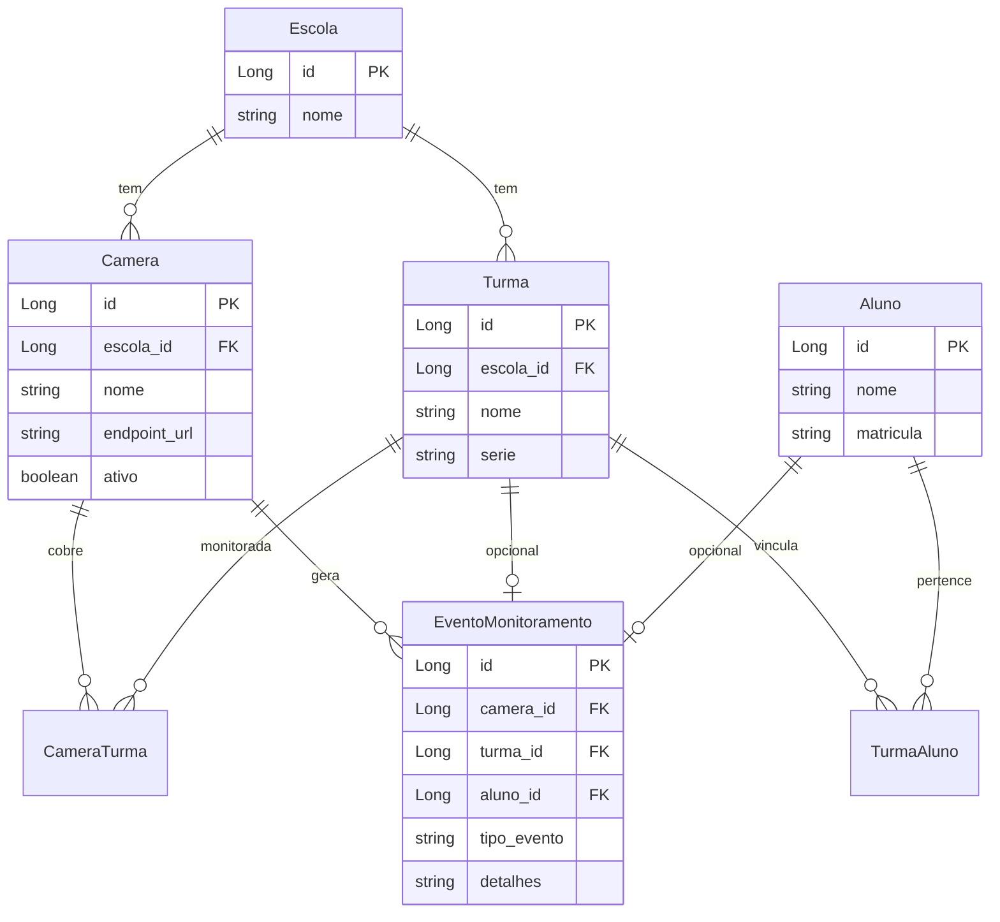

# Domínio — FaceLogAI

Modelo de domínio do MVP (persistência JPA + Flyway). Diagrama para portfólio / entrevista.

## Leitura rápida

| Relação | Significado |
|---------|-------------|
| Escola → Turma / Camera | Contexto institucional |
| Turma ↔ Aluno | Vínculo N:N (`turma_aluno`) |
| Camera ↔ Turma | Cobertura N:N (`camera_turma`) |
| Camera → Evento | **Log** de monitoramento (obrigatório); não é stream nem IA |
| Turma / Aluno → Evento | Contexto opcional no evento |

`TipoEvento` inclui `ROSTO_RECONHECIDO` / `ROSTO_DESCONHECIDO` como **rótulos de log**. O MVP não executa reconhecimento facial.

Auth (`Usuario` + JWT) fica fora deste diagrama — ver matriz de permissões no [`README.md`](../../README.md).
